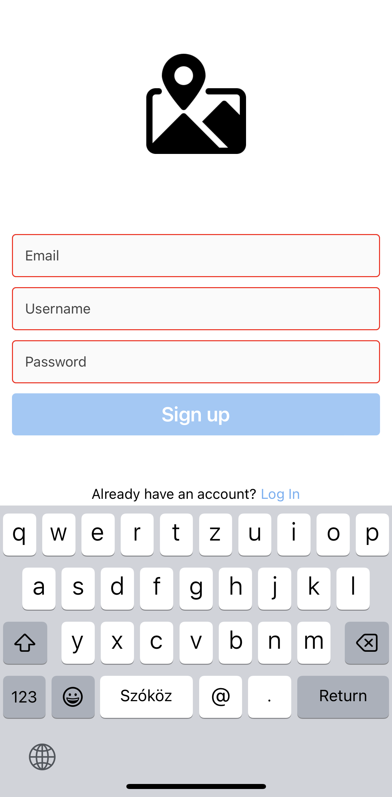

# Snapshot App

This is a snapshot app built using React Native. It allows users to create posts and view them on a map. The app utilizes Firebase for authentication, database storage, and cloud storage.

## Installation

- Clone the repository to your local machine.
- Navigate to the project directory.
- Install Expo CLI globally by running the following command:
```bash
npm install -g expo-cli
```
- Install the required dependencies by running the following command:
```bash
npm install
```
- Set up a Firebase project and obtain the configuration details (apiKey, authDomain, projectId, storageBucket, messagingSenderId, appId, measurementId).
- Open the App.js file and replace the Firebase configuration placeholders with your own configuration details:
```bash
  const firebaseConfig = {
    apiKey: "<YOUR_API_KEY>",
    authDomain: "<YOUR_AUTH_DOMAIN>",
    projectId: "<YOUR_PROJECT_ID>",
    storageBucket: "<YOUR_STORAGE_BUCKET>",
    messagingSenderId: "<YOUR_MESSAGING_SENDER_ID>",
    appId: "<YOUR_APP_ID>",
    measurementId: "<YOUR_MEASUREMENT_ID>"
    };
```
- Run the app using Expo CLI by running the following command:
```bash
npx expo start
```
- Expo DevTools will open in your browser. You can then choose to run the app on an emulator, a physical device, or the web.

    
## Features

Users can perform the following actions:

- **Register:** Create a new account with a valid email address and password.
- **Login:** Sign in to an existing account using the registered email address and password.
- **Main:** View the main screen, which displays posts of the user.
- **Add:** Create a new post by providing relevant information.
- **Save:** Save a new post to the database.
- **Map:** View a map with markers indicating the locations of user.
- **Post:** View a specific post with detailed information.


## Screenshots

<div style="display: flex; justify-content: center;">
  
  
  
  
  
  
  
  
  
</div>


